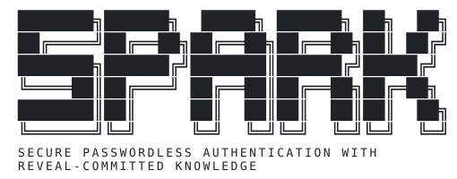

[](https://doi.org/10.5281/zenodo.21207792)

[](LICENSE)                                                                                                                                       


<p align="left">
  
  
</p>

<hr>

## Overview

SPARK is a research prototype created as part of my University of York BSc Computer Science dissertation. 
It has since been further refined with the help of my supervisor and co-author Roberto Metere, and is now being prepared for submission to SEFM'26.

SPARK is comprised of a PAM module and a companion app, which implement a secure challenge-response using the sign-then-encrypt scheme.
The underlying protocol is formally verified using ProVerif and EasyCrypt.

<hr>

## Contents
This repository contains the source code for the SPARK PAM module and companion app, as well as the formal verification proofs.

- `AE.md`: SEFM'26 artefact evaluation appendix, badge claims and evaluation steps.
- `quickstart.sh`: runs the Proofs and PAM components end-to-end for a quick sanity check.
- `Proofs`: ProVerif and EasyCrypt models, Docker scripts.
- `PAM`: verifier daemon and PAM module (C, cmake), Docker image.
- `App`: companion Android app (requires a real phone, not covered by `quickstart.sh`).

Run `./quickstart.sh` from the repo root to check the Proofs and PAM components (Docker required).

### Proofs
The `Proofs` directory contains the formal verification proofs for the SPARK protocol, implemented using ProVerif and EasyCrypt.

The `Proofs` directory contains the following files:
- `spark-setup.pv`: ProVerif model of the SPARK setup phase.
- `spark-remote.pv`: ProVerif model of the SPARK authentication phase.
- `HashCommit.ec`: EasyCrypt model of the hash commitment scheme used in SPARK.

In order to run the proofs, you will need to have ProVerif and EasyCrypt installed **or** docker.

#### Run locally

1. Install ProVerif 2.05 and EasyCrypt (see the respective documentation for installation instructions).
2. Navigate to the `Proofs` directory.
3. Run the following command to execute the ProVerif proofs:
   ```bash
   proverif spark-setup.pv
   ```
   ```bash
   proverif spark-remote.pv
   ```
4. Run the following command to execute the EasyCrypt proofs:
   ```bash
   easycrypt HashCommit.ec
   ```

#### Docker
Alternatively, you can use Docker to run the proofs without installing ProVerif and EasyCrypt locally.
We have made some simple bash scripts to run the proofs in a Docker container. To use the Docker scripts, follow these steps:

1. Install Docker (see the [Docker documentation](https://docs.docker.com/get-docker/) for installation instructions).
2. Navigate to the `Proofs` directory.
3. Run the following command to execute all of the proofs in a Docker container:
    ```bash
    ./run-proofs.sh
    ```
   You can also run each proof individually with `./run-proverif-setup.sh`, `./run-proverif-remote.sh` and `./run-easycrypt.sh`.


#### Expected output

The ProVerif proofs print one `RESULT` line per security query. `spark-setup.pv` should end with:

```
RESULT event(userVerified(sasV,sasA)) ==> event(verifierGenerated(v,a,sasV)) && event(authenticatorGenerated(v,a,sasA)) is true.
```

and `spark-remote.pv` should print:

```
RESULT Query secret N [real_or_random] encoded as equivalence is true.
RESULT secret N is true.
RESULT inj-event(verifierSuccess(p1,p2,n)) ==> inj-event(authenticatorFinished(p1,p2,n)) is true.
RESULT event(authenticatorFinished(p1,p2,n)) ==> event(verifierStarted(p1,p2,n)) is true.
RESULT inj-event(authenticatorFinished(p1,p2,n)) ==> inj-event(verifierStarted(p1,p2,n)) is false.
```

The final `is false` is expected: it is the one deliberately non-injective query in the paper (a replayed challenge makes the authenticator re-sign, which the verifier then rejects), so it is a pass, not a failure.

The EasyCrypt proof succeeds if it exits without errors the `run-easycrypt.sh` script checks this for you and prints `Clean pass`.

### PAM
The `PAM` directory contains the verifier side of SPARK: a standalone authenticator daemon and a PAM module (`pam_authenticator.so`) that hooks it into Linux authentication.

To build it you will need a C compiler, `cmake`, `make`, PAM headers, and the following libraries: OpenSSL, BlueZ, libwebsockets, libcjson and tss2-esys (for the TPM 2.0 monotonic counter). On Debian/Ubuntu:

```bash
sudo apt install gcc cmake make libssl-dev libbluetooth-dev libwebsockets-dev libcjson-dev libtss2-dev libpam0g-dev libcrypt-dev
```

Then, from the `PAM` directory:

1. Run the build script:
   ```bash
   ./build_pam.sh
   ```
   This builds the authenticator and the PAM module, and creates a test PAM configuration in `pam_config/`. Add `--install` to install the module to your distro's PAM security directory (auto-detected, e.g. `/usr/lib/security` on Arch, `/usr/lib/x86_64-linux-gnu/security` on Debian/Ubuntu; requires sudo).
2. Pair a phone with the machine:
   ```bash
   ./setup.sh <username>
   ```
   This starts the pairing flow: both devices display an emoji SAS string, and you confirm on the phone that they match.
   Pairing ends by printing three one-time login codes and one re-pair code (five EFF Diceware words each). Write them down; the screen is cleared after you press Enter.

#### Recovery codes
A login code works once, with or without the phone. Type it into the password field at login (SDDM and similar greeters, which hand it over once the phone flow has failed), or at the `Login code:` prompt that appears after the phone flow fails (GDM, console, sudo). Logins never consume the re-pair code, so it is always there for `spark-pair` when the phone is gone. Using any code prints a warning on every later phone login until you re-pair. Do not stack `pam_authenticator.so` after a password module: a token set by an earlier module is treated as a recovery code.

Only yescrypt hashes are stored, in the root-only `/etc/AuthApp/<username>.conf`. Online guessing is bounded by `pam_faillock` in the generated PAM config (3 attempts, 15 minute lock), so keep those lines when you adapt it. Failed phone attempts count too, so three tries with the phone off locks the account for 15 minutes (`faillock --user <name> --reset` clears it).

Re-pairing does not need sudo, but it does need the re-pair code, otherwise anyone at an unlocked desktop could pair their own phone and invalidate your codes. `./build_pam.sh --install` installs `spark-pair`, a polkit action that lets an active local session launch it as root, and `/etc/pam.d/spark-pair`, the PAM service the tool runs before pairing (faillock plus `pam_authenticator.so repair`, nothing else). Nothing is added to `polkit-1`, so the re-pair code cannot authorise any other polkit action.
   ```bash
   pkexec /usr/local/bin/spark-pair
   ```
   It asks for the re-pair code, always, phone or no phone, and issues a fresh set on success. The code is only replaced by a successful pairing, so a failed attempt can be retried with the same one. A lost phone therefore costs one login code to get in and the re-pair code to pair the replacement. Running it directly as root (`sudo spark-authenticator --setup <user>`) skips the code, since root can delete the config anyway; that is also how a machine paired before re-pair codes existed gets one. If you run out of login codes with no phone, boot a live system and delete `/etc/AuthApp/<username>.conf`, then pair again.


The unit tests (frame codec, communications, crypto envelope and recovery codes) can be run with:

```bash
ctest --test-dir build
```

#### Docker
Alternatively, build and test PAM in Docker without installing the libraries locally:

```bash
docker build -t spark-pam -f PAM.dockerfile .
docker run --rm spark-pam
```

This builds `pam_authenticator.so` and runs the unit tests, the same ones `ctest --test-dir build` runs locally.

#### Where the files end up
- `build/Authenticator`: the standalone authenticator daemon.
- `build/pam/pam_authenticator.so`: the PAM module. Installed to your distro's PAM security directory (auto-detected) with `./build_pam.sh --install`.
- `pam_config/authenticator-test`: a test PAM service config generated by `build_pam.sh`, using `pam_authenticator.so` for auth.

#### Testing with pamtester
`pamtester` lets you exercise the PAM module directly, without going through login/sudo. With a phone already paired (see `setup.sh` above) and `authenticator-test` installed to `/etc/pam.d/`:

```bash
sudo cp pam_config/authenticator-test /etc/pam.d/
pamtester authenticator-test <username> authenticate
```

This triggers the same challenge-response flow as a real login: the daemon contacts the paired phone, and the PAM module accepts or rejects based on its response.

### App
The `App` directory contains the companion Android app, which holds the authenticator key in the hardware-backed keystore and asks for a biometric-verified tap before answering a login challenge.

It is a standard Gradle project (minimum SDK 24). To build it, either open `App` in Android Studio, or from the `App` directory run:

```bash
./gradlew assembleDebug
```

and install the resulting APK on a phone. Pairing with a desktop is done from within the app, as described in the PAM section above.

Plug the phone in over USB with developer mode/USB debugging enabled and run `./gradlew installDebug`, or build/deploy directly from Android Studio. The app will prompt for the Bluetooth and biometric permissions it needs on first launch. Tested on a Pixel 9a.

> **Note**: The App requires real phone hardware (Bluetooth and a hardware-backed biometric keystore) and cannot be run headlessly in Docker/CI. 

<hr>

## License

SPARK is released under the Apache 2.0 license see [LICENSE](LICENSE).

